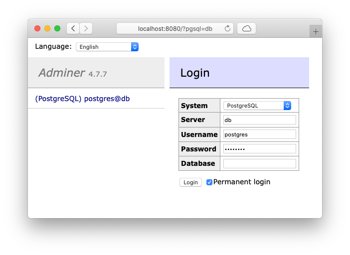
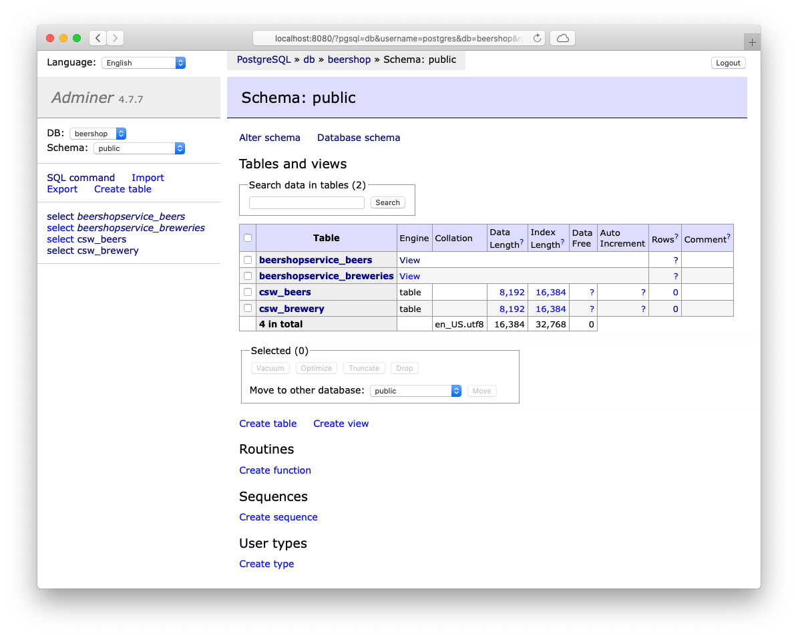
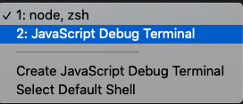

# contributing to `cds-pg`

The PostgreSQL adapter to `CAP` lives off of the effort of the community 🧍‍♀️🧍🧍‍♂️.  
Only _together_ can we get this to a state where `cds-pg` achieves production-level quality 💪, providing a persistence option outside `sqlite` and `hana`.

**The overall goal is to validate SQL-results in PostgreSQL by issuing OData-calls via `cds`**:  
because we know the data model, we can predict the result of the OData call, thus asserting the correct SQL statement and `cds.Service`-implementation via PostgreSQL.

The two most crucial files/code points are:

- API implementation of `cds.Service` in `index.js`
- `cqn` to PostgreSQL-`sql` "compiler" in `lib/cqn2pgsql.js`

There most likely the majority of your work will take place.

The path towards _what to implement_ is paved via the tests (in `__tests__/*`) that issue bespoken OData-calls and provide example `cqn`-queries to transform.

The idea is to grab any not-yet-implemented (`test.todo(..)`) or incomplete (`test.skip(...)`) test and/or add new ones, and implement functionality of `cds-pg` based on those tests.

## in here

- [setting up the development environment](#setting-up-the-development-environment)
  - [initial setup](#initial-setup)
  - [local PostgreSQL server with content](#local-postgresql-server-with-content)
  - [runnable queries and runtime debug capabilites](#runnable-queries-and-runtime-debug-capabilites)
    - [OData queries](#odata-queries)
    - [Debugging](#debugging)
  - [comparison possibility with sqlite](#comparison-possibility-with-sqlite)
- [other thingies](#other-thingies)
- [Collaboration](#collaboration)

## setting up the development environment

there's multiple parallel levels that we recommend to set up in order to develop further features for `cds-pg`.  
essentially, this boils down to 3 things:

- local PostgreSQL server with content + Web-UI
- runnable OData queries + a test environment with debug (breakpoint) capabilites
- comparison with a supported persistence driver, sepcifically `sqlite` in-memory

With the above in place, coding 👨‍💻 becomes a charm :)

### initial setup

install required node modules:

```bash
$> npm i
```

use `node` in version `lts/erbium`.  
there's a `.nvmrc` provided, so on OS's supporting this, it's a matter of

```bash
$> nvm use
```

`CDS_DEBUG` and `DEBUG` environment variables are respected. Setting them causes `cds-pg` to produce verbose logging output (which you want 😉).

`Visual Studio Code` is the recommend IDE (b/c we use it 😆).  
If you're on a different IDE - no sweat, but we might not be able to help with e.g. debugging capabilites.

### local PostgreSQL server with content

we're providing a docker image that gets filled with content upon boot.  
in order for this to work, you need [`docker-desktop`](https://www.docker.com/products/docker-desktop) installed.  
then it's a matter of running `npm run test:pg:up-nobg` that does all the heavy lifting for you.

```bash
$> npm run test:pg:up-nobg
# ...
Creating network "cap-proj_default" with the default driver
Creating cap-proj_db_1      ... done
Creating cap-proj_adminer_1 ... done
Attaching to cap-proj_adminer_1, cap-proj_db_1
# ...
```

In addition to a standalone, pre-filled PostgreSQL server, this also gives you a web-based frontend for PostgreSQL at http://localhost:8080


Choose `PostgreSQL` as `System`,  
`Username`: `postgres`,  
`Password`: `postgres`.

Upon successful login, you'll see the `beershop` db, w00t 🍺


### runnable queries and runtime debug capabilites

`jest` is the test-runner and -framework.  
All tests are located in `__tests__`, files important for the test run-time in `__test__/__assets__`.

If the standalone `PostgreSQL` server is running as explained above, you can use regular `jest` commands and flows:

- `npm run jest` runs all tests in `__tests__`

  ```bash
  $> npm run jest
    # ...
    PASS  __tests__/cqn2pgsql.js
    PASS  __tests__/odata.js

    Test Suites: 2 passed, 2 total
    Tests:       3 skipped, 7 todo, 4 passed, 14 total
    Snapshots:   0 total
    Time:        3.936 s
  ```

- run a single test
  - by editing one of the test files, issuing `test.only(/*...*/)`
  - calling `npm run jest` or from the command line: `$> node_modules/.bin/jest`
- turn on `jest`'s watch mode and morph into TDD-mode: `$> node_modules/.bin/jest --watch`

#### OData queries

`supertest` is used for bootstrapping http requests, e.g. in `__tests__/odata.js`.  
Since it's the goal to validate the query-results on PostgreSQL-level by issuing OData-calls via the `cds`-framework, the OData queries are the "test-base" for transformation of `cqn` to PostgreSQL's SQL dialect.

The more OData queries we have to test, the more complete `cds-pg` will be as a persistence layer.

#### Debugging

A debug configuration is provided for VS Code in `.vscode/launch.json`.  
Open a test file (from `__tests__`), and shoot of `run current test file` in VS Code's `debug` view in order to...well...debug the current test file.

As an alternative in VS Code, just open/create a `JavaScript Debug Terminal` and shoot of `npm run jest`.

Any set breakpoints in the code will then be hit during run-time of the tests.

### comparison possibility with `sqlite`

To be able to compare expected OData query results within an officially (by SAP) supported scenario,  
`npm run test:as-sqlite`  
bootstraps the base cap project in `__tests__/__assets__/cap-proj` with an in-mem SQListe database.

```bash
$> npm run test:as-sqlite
# ...
 > filling csw.Beers from db/data/csw-Beers.csv
 > filling csw.Brewery from db/data/csw-Brewery.csv
/> successfully deployed to sqlite in-memory db


[cds] - model loaded from 3 file(s):

  db/schema.cds
  srv/beershop-service.cds
  ../../../node_modules/@sap/cds/common.cds

[cds] - connect to db > sqlite { database: ':memory:' }
 > filling csw.Beers from db/data/csw-Beers.csv
 > filling csw.Brewery from db/data/csw-Brewery.csv
/> successfully deployed to sqlite in-memory db

[cds] - connect to messaging > local-messaging {}
[cds] - serving BeershopService { at: '/beershop' }

[cds] - launched in: 1210.114ms
[cds] - server listening on { url: 'http://localhost:4004' }
[ terminate with ^C ]
```

As stated above, the SQLite-based app is accessible via http://localhost:4004

## other thingies

- `prettier` is used for code styling, configured in `package.json` -> please adhere to the formatting rules :)
- `eslint` is is responsible for static code checks, see `.eslintrc.json`
- git commit messages are linted: they need to adhere to the "[conventional changelog](https://www.conventionalcommits.org/en/v1.0.0/)" rules that are based on the [angular commit guidelines](https://github.com/angular/angular/blob/master/CONTRIBUTING.md#commit)  
  this makes it easier for us maintaining a changelog

## Collaboration

Please provide pull requests against the `main` branch of this project.  
On every PR, the entire test suite is run against a dockerized `postgres` database, helping to prevent bugs and catch'em regressions :)  
A reviewer is required for each PR. As of now, please add either [@gregorwolf](https://github.com/gregorwolf) or [@vobu](https://github.com/vobu).  
Our hopes are high that one day, [@aragonX](https://twitter.com/aragonx) will chime in and lead all this :)
